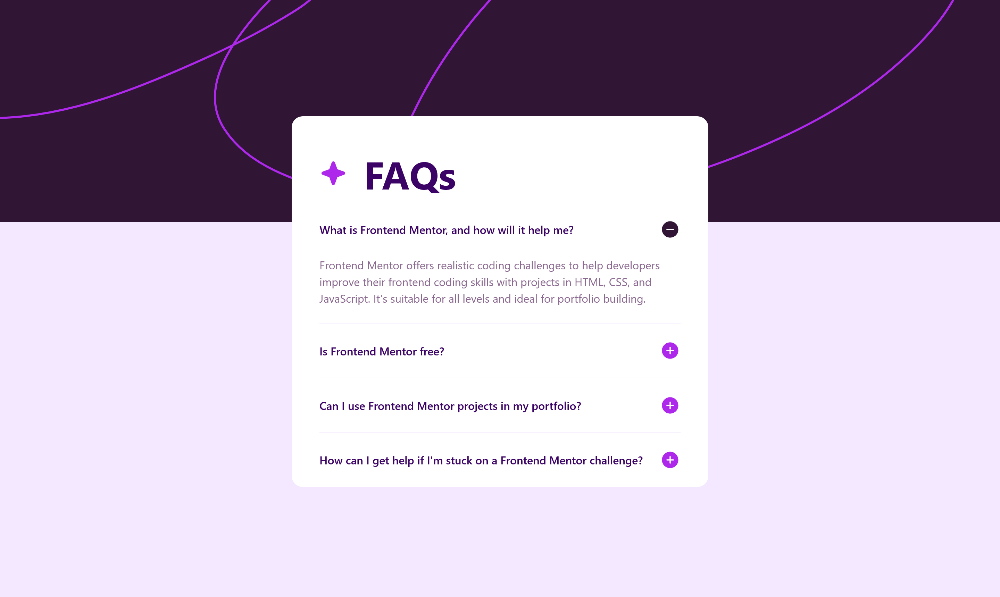

# Frontend Mentor - FAQ accordion solution

This is a solution to the [FAQ accordion challenge on Frontend Mentor](https://www.frontendmentor.io/challenges/faq-accordion-wyfFdeBwBz). Frontend Mentor challenges help you improve your coding skills by building realistic projects.

## Table of contents

- [Overview](#overview)
  - [The challenge](#the-challenge)
  - [Screenshot](#screenshot)
  - [Links](#links)
- [My process](#my-process)
  - [Built with](#built-with)
  - [What I learned](#what-i-learned)
  - [Continued development](#continued-development)
  - [Useful resources](#useful-resources)
- [Author](#author)

## Overview

### The challenge

Users should be able to:

- Hide/Show the answer to a question when the question is clicked
- Navigate the questions and hide/show answers using keyboard navigation alone
- View the optimal layout for the interface depending on their device's screen size
- See hover and focus states for all interactive elements on the page

### Screenshot

### Links

- Solution URL: [Add solution URL here]
- Live Site URL: [Add live site URL here]

## My process

### Built with

- Semantic HTML5
- Tailwind CSS
- Vanilla JavaScript
- Mobile-first approach
- Vite as bundler
- Responsive design

### What I learned

During this project, I reinforced several important concepts:

1. **Tailwind CSS**:

   - Implementation of a custom design system with color variables
   - Usage of responsive classes for different breakpoints
   - Handling interactive states (hover, focus) with utility classes

2. **JavaScript**:

   - Implementation of an interactive accordion
   - Event handling for keyboard and mouse interaction
   - Class toggling for showing/hiding content

3. **Accessibility**:
   - Implementation of keyboard navigation
   - Usage of ARIA attributes to improve accessibility
   - Semantic HTML structure

### Continued development

Areas I would like to focus on in future projects:

- Improve accordion animation using CSS transitions
- Implement unit testing
- Optimize image loading performance
- Enhance accessibility with more ARIA features

### Useful resources

- [Tailwind CSS Documentation](https://tailwindcss.com/docs) - Excellent resource for learning and consulting utility classes
- [MDN Web Docs - ARIA](https://developer.mozilla.org/en-US/docs/Web/Accessibility/ARIA) - Great resource for learning about web accessibility
- [Google Fonts - Work Sans](https://fonts.google.com/specimen/Work+Sans) - The font used in this project

## Author

- Frontend Mentor - [@gusanchedev](https://www.frontendmentor.io/profile/gusanchefullstack)
- GitHub - [@gusanchedev](https://github.com/gusanchefullstack)
